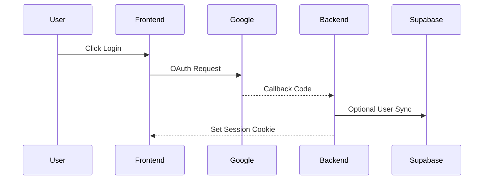
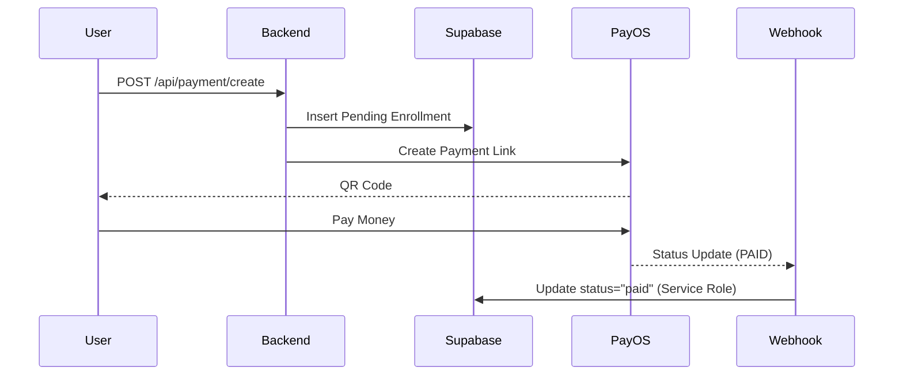

# Technical Blueprint (Architecture)

## 1. Service Mapping

| Layer        | Service             | Key Responsibility                 | Auth Mode          |
| :----------- | :------------------ | :--------------------------------- | :----------------- |
| **Frontend** | Next.js (Client)    | Rendering, UI State                | Session Cookie     |
| **Backend**  | Next.js Handler     | Business Logic, PayOS Interaction  | JWT / Session      |
| **Auth**     | NextAuth + Google   | Identity Provider                  | OAuth 2.0          |
| **Database** | Supabase (Postgres) | Persistence (Enrollments, Courses) | RLS + Service Role |
| **Storage**  | Cloudflare R2       | Asset Management                   | S3 API             |

## 2. Core Flows (Architecture)

### Authentication Flow

### Payment Flow (PayOS)

## 3. Directory Guide (Actionable)

- `src/app/api/`: Logic for Auth, Webhooks, Payments.
- `src/utils/`: Infrastructure clients (Supabase, PayOS).
- `src/components/auth/`: UI logic for protected access.
- `docs/`: Technical manuals & Runbooks.
